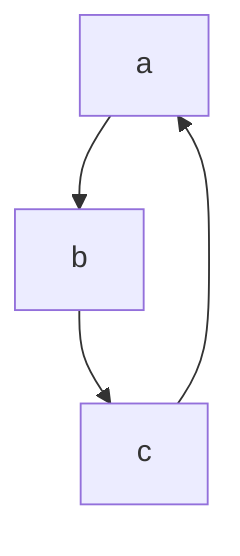

# Фасилитация
Индивид под влиянием группы ==деятельность выполняет лучше==, чем если он её выполнял в одиночестве.
## Нога в дверях
Феномен в психологии

# Большие группы
- Стихийные группы
	- толпа
	- масса
	- публика
- Устойчивые группы

## Толпа
*Механизмы, действющие в толпе:*
- подражание
- внушение
- заражение

# Конфликт
**Конфликт** - столкновение субъектов социального взаимодействия, предполагающее ==нанесения взаимного ущерба==.
## Структура конфликта
*Без чего невозможно конфликтовать:*
1) Наличие оппонента
2) Предмет кофликта
3) Позиция оппонента
4) Мотивы оппонента

*Необязательный элемент:*
- Подстрекатели

### Классификации конфликтов
- По объекам конфликта
- По сфере проявления конфликта
- По результативности конфликта
- По статусности участников
	- По горизовнтали
	- По вертикали
	- Смешанный конфликт
- Классификации по двум критериям:
	- По напряженности
	- По длительности конфликта

## Стили поведения в конфликте
**Томас** и **Килмен** разработали *конфликтологическую сетку*.
*==Входящие стили==*:
1) **Конфронтация\соревнование\соперничество**
2) **Уклонение\избегание**
3) **Приспособление**
4) **Компромиз**
5) **Сотруднечество**
*==Два критерия классификации==*:
- *Активные* или *пассивные* действия
- *Совместные* или *индивидуальные* действия

>Конфликтологи считают, что эффективно владеть всеми пятью стилями

*//Пример простроение диаграмм*

Конфликты без предмета конфликта:
- Это конфликты на основе **конфликтогенов**, то есть вместо конфликта конфликтоген.

### Никогда не отвлечать конфликтогеном на конфликтоген
### Никогда самим не использовать конфликтоген
## Соотрудничество
**Мой выигрыш - твой выигрыш**

## Карта возможностей
| Критерии                    |   Стили поведения  |   Реакции опонента  |  Вероятность реакции   |  Желательность реакции   |  Вероятность * Желательность   |
| --------------------------- | --- | --- | --- | --- | --- |
| Характеристика конфликта    |     |     |     |     |     |
| Единичный или повторяющийся |     |     |     |     |     |
