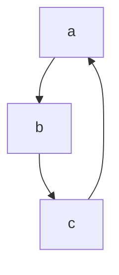

# Фасилитация
Индивид под влиянием группы ==деятельность выполняет лучше==, чем если он её выполнял в одиночестве.
## Нога в дверях
Феномен в психологии

# Большие группы
- Стихийные группы
	- толпа
	- масса
	- публика
- Устойчивые группы

## Толпа
*Механизмы, действющие в толпе:*
- подражание
- внушение
- заражение

# Конфликт
**Конфликт** - столкновение субъектов социального взаимодействия, предполагающее ==нанесения взаимного ущерба==.
## Структура конфликта
*Без чего невозможно конфликтовать:*
1) Наличие оппонента
2) Предмет кофликта
3) Позиция оппонента
4) Мотивы оппонента

*Необязательный элемент:*
- Подстрекатели

### Классификации конфликтов
- По объекам конфликта
- По сфере проявления конфликта
- По результативности конфликта
- По статусности участников
	- По горизовнтали
	- По вертикали
	- Смешанный конфликт
- Классификации по двум критериям:
	- По напряженности
	- По длительности конфликта

## Стили поведения в конфликте
**Томас** и **Килмен** разработали *конфликтологическую сетку*.
*==Входящие стили==*:
1) **Конфронтация\соревнование\соперничество**
2) **Уклонение\избегание**
3) **Приспособление**
4) **Компромиз**
5) **Сотруднечество**
*==Два критерия классификации==*:
- *Активные* или *пассивные* действия
- *Совместные* или *индивидуальные* действия

>Конфликтологи считают, что эффективно владеть всеми пятью стилями

*//Пример простроение диаграмм*

Конфликты без предмета конфликта:
- Это конфликты на основе **конфликтогенов**, то есть вместо конфликта конфликтоген.

### Никогда не отвлечать конфликтогеном на конфликтоген
### Никогда самим не использовать конфликтоген
## Соотрудничество
**Мой выигрыш - твой выигрыш**

## Карта возможностей
| Стили поведения |     Реакция опонента     | Вероятность реакции | Желательность реакции | Вероятность * Желательность |
| --------------- |:------------------------:|:-------------------:|:---------------------:|:---------------------------:|
| Соперничество   | Раскричался и разрыдался |          4          |           1           |              4              |
| Уклонение       |          Удивился          |          2          |           4           |              8              |
| Компромисс      |       Не доволен, но успокоился       |          5          |           2           |             10              |
| Присобление     |             Очень понравилось, почувствовал себя победителем           |           4          |             2          |    8                         |
#### Краткая характеристика конфликта: 
Мы с моим братом поспорили касательно его уроков по английскому языку. Он считал, что делает все верно, хотя по моему мнению он сделал просто ужасно халтурно и я заставил его переделывать. Но он начал спорить и всячески отказываться выполнять мои требования. Тут-то на почве уроков у нас с братом возник конфликт. Подобного рода конфлик повторялся **неоднократно**.

# Динамика конфликта
Любой конфликт делять на три периода:
1) **Скрытый** или *латентный* конфликт
	1) Возникновение ==объективной проблемной ситуации==
	2) Осознание объективной проблемной ситуации.
	3) ==Попытка решить== проблемную ситуацию== неконфликтным путем==.
	4) Осознание конфликтной ситуации
1) **Открытый** конфликт(собственно конфликт)
	1) Инцидент
	2) Эскалация конфликта
	3) Осознанное взаимодействие
	4) Разрешение конфликта
2) **Постконфликтная** ситуация или снова *латентный* конфликт
	1) Частичное восстановление конфликта
	2) Полное восстановление конфликта